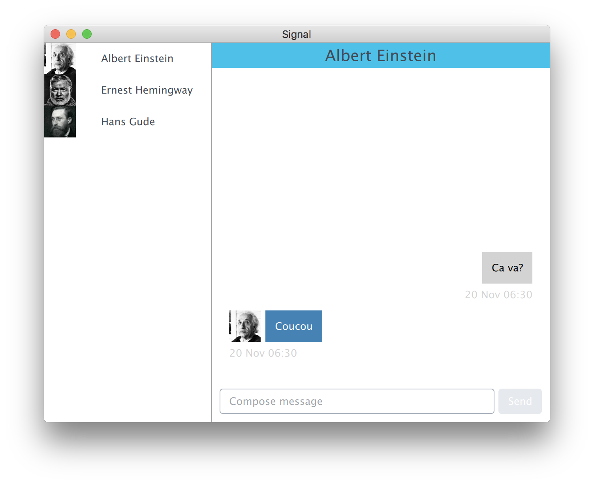

# signal-qt

**This is a third-party effort, and is NOT a part of the official [Signal](https://signal.org) project or any other project of [Open Whisper Systems](https://whispersystems.org).**

**WARNING: This adapter is currently undergoing a security audit. It should not be regarded as secure, use at your own risk. I am not a cryptographer, I just encrypt a lot.**

A Signal Qt client:

